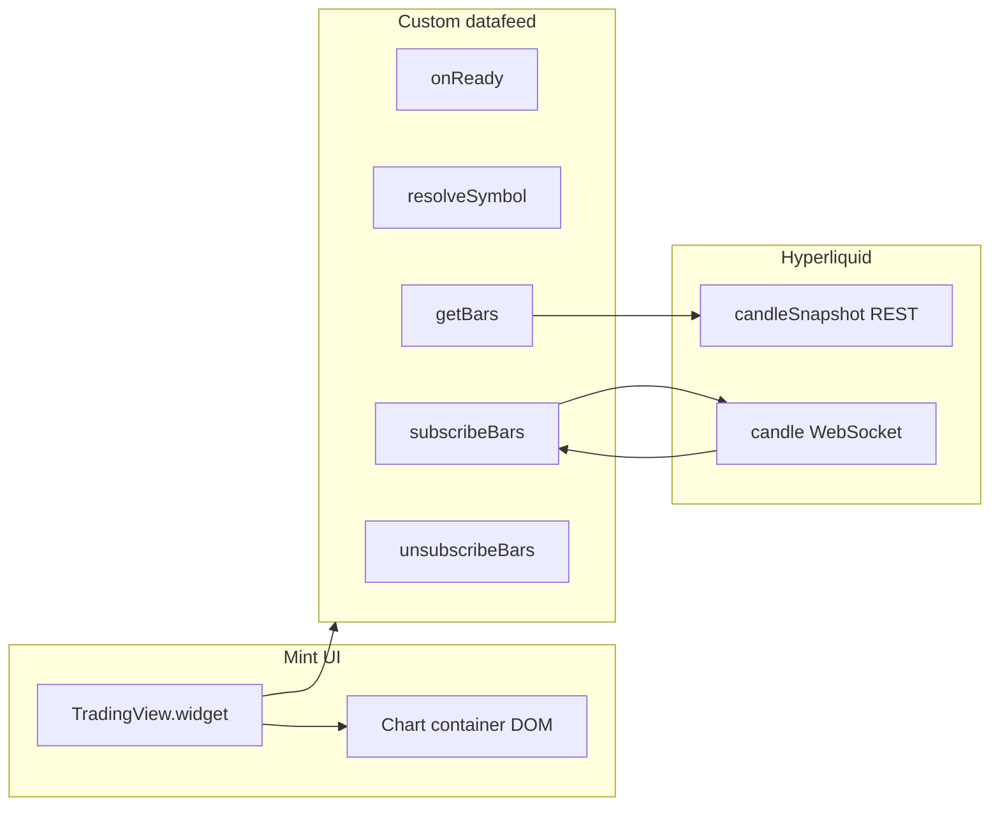

# Mint page: advanced chart (TradingView) — architecture

The mint price chart is a **TradingView Charting Library** widget backed by **Hyperliquid** history (REST `candleSnapshot`) and live candles (WebSocket). The script is loaded at runtime via `ensureChartingLibraryLoaded`; there is no demo UDF datafeed.

## Runtime overview

| Piece | Role |
| ----- | ---- |
| **`AdvancedChart.tsx`** | Mounts the widget, passes `symbol` from Redux (`selectSelectedTargetAsset`), **initial** `interval` as a TV `ResolutionString`, theme, custom CSS, and the custom datafeed. Users switch timeframes with TradingView’s **Resolution** control (only resolutions the datafeed advertises are available). |
| **`createHyperliquidDatafeed.ts`** | Implements TV’s datafeed contract: `onReady`, `resolveSymbol`, `getBars`, `subscribeBars`, `unsubscribeBars`, `getMarks`, etc. |
| **`fetchHyperliquidCandleSnapshot` (`candleSnapshot.ts`)** | POSTs `candleSnapshot` to `https://api.hyperliquid.xyz/info`. |
| **`HyperliquidCandleStreamHub` (`candleStreamHub.ts`)** | Single WS subscription per active `(coin, interval)` for realtime bars. |
| **`hyperliquidCandleIntervals.ts`** | Canonical list of intervals Hyperliquid supports (`1m` … `1M`); bar length in ms for trade marks. |
| **`resolutions.ts`** | Maps each Hyperliquid interval ↔ TradingView resolution string; builds `supported_resolutions` for `onReady` / `resolveSymbol`. |
| **`tradeMarksForDatafeed.ts`** | Builds TV marks from indexer trades (`getMarks`). |
| **Styling** | `advancedChartWidgetOptions.ts`, `advancedChartCustomThemes.ts`, `charting_custom/advanced-chart.css`, `TradingView.widget` `theme` + `overrides`. |

`src/constants/chartTimeIntervals.ts` is still used elsewhere on mint (e.g. position line charts); the **advanced chart does not** use that smaller set for its datafeed.

### Realtime stream and background tabs

`HyperliquidCandleStreamHub` **does not close** the candle WebSocket when the user hides the tab. Doing so and then calling TradingView’s `onResetCacheNeededCallback` on return could make the library run `unsubscribeBars` before we reattached listeners, so **live bars and the head price** (`onRealtimeBar`) never resumed. Returning to the tab only runs `ensureSocket()` if the link died; an **unexpected** `onclose` while subscribers exist schedules a reconnect on a microtask.

## End-to-end data flow

The widget never calls Hyperliquid directly; only the datafeed does.

## Datafeed responsibilities

TradingView’s [Datafeed API](https://www.tradingview.com/charting-library-docs/latest/connecting_data/datafeed-api/) (subset used here):

| Method | Role |
| ------ | ---- |
| **`onReady`** | `DatafeedConfiguration` with `supported_resolutions` = every TV resolution we map from Hyperliquid (see below). |
| **`searchSymbols`** | Minimal / empty — symbol is fixed by mint asset selection. |
| **`resolveSymbol`** | Hyperliquid `coin` string → `LibrarySymbolInfo` (ticker, pricescale, session, `supported_resolutions`). |
| **`getBars`** | TV `periodParams` (Unix **seconds**) → ms window → `candleSnapshot` → `Bar[]` with **UTC ms** `time`. |
| **`subscribeBars`** / **`unsubscribeBars`** | `HyperliquidCandleStreamHub` subscribes to `candle` WS for `(coin, interval)`; pushes updates to TV’s callback. |
| **`getMarks`** | User trades for markers (mint implementation uses `marksContext`). |

Hyperliquid snapshot rows: `{ t, o, h, l, c }` with `t` in **ms** (UTC). TV `Bar.time` is **UTC ms** per `public/charting_library/datafeed-api.d.ts`.

## Time alignment

We feed **UTC** times straight from Hyperliquid into TV (no local-time shifting in the datafeed). That matches TV’s session model and keeps history/realtime consistent.

## Symbol mapping

- **Hyperliquid** series key is **`coin`** (e.g. perp coin string aligned with the selected mint target asset).
- **TradingView** receives that same string as `symbol` on the widget and as `LibrarySymbolInfo.ticker` from `resolveSymbol`.

## Resolution mapping (Hyperliquid-native, full set)

The datafeed exposes **every interval Hyperliquid documents** for `candleSnapshot` / `candle` WS—not the shorter mint-only list in `chartTimeIntervals.ts`. TradingView’s own default menu can include frames Hyperliquid does not serve (e.g. some second or synthetic minute bars); those are **not** listed in `supported_resolutions`, so users only pick resolutions we can load without client-side OHLC resampling.

TV uses [resolution strings](https://www.tradingview.com/charting-library-docs/latest/ui_elements/Resolution#resolution-format) (minutes as `"1"`, `"60"`, …, or `"1D"`, `"1W"`, `"1M"`).

| Hyperliquid `interval` | TV resolution |
| ---------------------- | --------------- |
| `1m` | `"1"` |
| `3m` | `"3"` |
| `5m` | `"5"` |
| `15m` | `"15"` |
| `30m` | `"30"` |
| `1h` | `"60"` |
| `2h` | `"120"` |
| `4h` | `"240"` |
| `8h` | `"480"` |
| `12h` | `"720"` |
| `1d` | `"1D"` |
| `3d` | `"3D"` |
| `1w` | `"1W"` |
| `1M` | `"1M"` |

`tradingViewResolutionToHyperliquidInterval` in `resolutions.ts` is used in `getBars`, `subscribeBars`, and `getMarks`. The widget’s initial `interval` prop must be one of the TV strings above (default **`"15"`** = 15m).

## Initial interval vs Redux

The **initial** resolution is the `interval` prop on `AdvancedChart` (default `"15"`). **Later** changes come only from the Charting Library UI. Symbol still comes from Redux (`selectSelectedTargetAsset`); interval does not.

## TypeScript and the Charting Library

Typings live under **`public/charting_library/`** (`charting_library.d.ts`, `datafeed-api.d.ts`). `src/types/chartingLibrary.ts` re-exports nominal types (e.g. `ResolutionString`). `src/types/tradingview.d.ts` augments **`Window`** with `TradingView.widget`. The app uses **`new window.TradingView.widget(...)`** after the script loads.

## Related source files

| Area | File(s) |
| ---- | ------- |
| Widget shell | `src/components/MintPage/ChartContainer/AdvancedChart/AdvancedChart.tsx` |
| Container / info bar | `ChartContainer.tsx`, `ChartInfoBar/` |
| Datafeed | `src/lib/hyperliquid/tradingView/createHyperliquidDatafeed.ts` |
| WS hub | `src/lib/hyperliquid/tradingView/candleStreamHub.ts` |
| HL interval list + ms | `src/lib/hyperliquid/tradingView/hyperliquidCandleIntervals.ts` |
| Bars mapping | `src/lib/hyperliquid/tradingView/rawCandleToTradingViewBar.ts` |
| REST snapshot | `src/lib/hyperliquid/candleSnapshot.ts` |
| Resolutions | `src/lib/hyperliquid/tradingView/resolutions.ts` |
| Marks | `src/lib/hyperliquid/tradingView/tradeMarksForDatafeed.ts` |
| Script / CSS URLs | `src/lib/tradingView/ensureChartingLibraryLoaded.ts`, `tradingViewAssetUrls.ts` |
